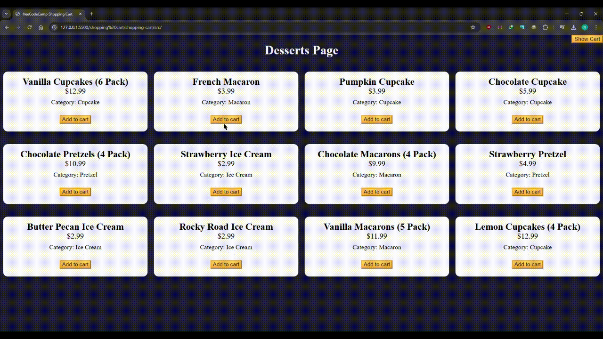

# Desserts Shopping Cart

This project is a web-based **Desserts Shopping Cart** application built using **HTML**, **CSS**, and **JavaScript**. It provides users with a dynamic interface to browse, add, and manage a cart of desserts while calculating totals and taxes.

---

## Features

- **Responsive UI** for browsing a variety of desserts.
- Add items to the shopping cart.
- View total items, subtotal, taxes, and total amount in real-time.
- Clear the cart with a single click.
- Show/hide the cart dynamically.

---

## How It Works

1. **Browse Desserts**:
   - Desserts are displayed as cards with names, prices, and categories.
   - Each card has an **Add to Cart** button.

2. **Add Items to Cart**:
   - Click the "Add to Cart" button on any dessert to add it to your shopping cart.
   - The total number of items, subtotal, taxes, and final total are updated dynamically.

3. **Cart Controls**:
   - **Show/Hide Cart**: Toggle the cart visibility using the "Show/Hide Cart" button.
   - **Clear Cart**: Remove all items from the cart with the "Clear Cart" button.

4. **Responsive Design**:
   - Adapts to different screen sizes for better usability.

---

## Setup and Usage

1. Clone or download the repository to your local machine.
2. Open the `index.html` file in your web browser.
3. Browse desserts, add them to the cart, and manage your selections.

---

## Technologies Used

- **HTML5**: Structure and content.
- **CSS3**: Styling and responsive design.
- **JavaScript (ES6)**: Interactive functionalities and dynamic cart management.

---

## JavaScript Overview

### Key Classes and Functions

1. **ShoppingCart Class**:
   - Manages cart items and calculates totals.
   - Key methods:
     - `addItem(id, products)`: Adds a dessert to the cart.
     - `clearCart()`: Clears all items in the cart.
     - `calculateTotal()`: Calculates subtotal, taxes, and total.

2. **Event Listeners**:
   - **Add to Cart Buttons**: Adds selected items to the cart.
   - **Show/Hide Cart Button**: Toggles cart visibility.
   - **Clear Cart Button**: Clears the cart.

## Demo

Below is a demo of shopping cart in action:

---